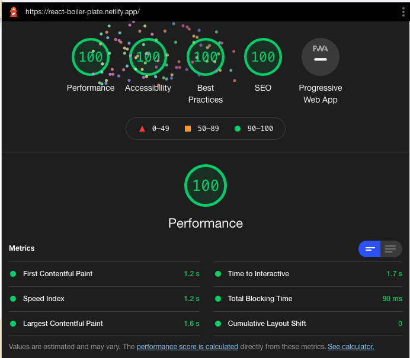

# React Boiler Plate (Front end starter)

[Live Demo](https://react-boiler-plate.netlify.app/)

This starter has a basic setup for

- webpack
- `.eslintrc.js`
- `.prettierignore`
- `netlify.toml`
- `postcss.config.js`
- `robots.txt`
- `.babelrc`
- `.vscode/extensions.json` (Recommended extensions)
- redux toolkit
- an email form with **EmailJS**
- image optimization and conversion to Webp using `sharp`
- `bootstrap`
- `react-router`
- `react-helmet`
- purgecss
- page header
- page footer
- social media share buttons
- a carousel

Use of this starter template assumes that you have a 'complete dev environment' setup - a terminal, Node, VS Code, at least. If not, you may want to [start here.](https://www.notion.so/codefinity/Setting-up-a-Local-Dev-Environment-for-JS-02a4e9f4a30043d3a8e7d109be3448f4)

---

## What's Included

- 
- ESLint with [`xo`](https://github.com/xojs/xo) style guide
- [Stylelint](https://stylelint.io/) for CSS linting. I am including the 'standard [configuration](https://stylelint.io/user-guide/configure)' with some additional rules to keep things alphabetical, indented with `2` spaces, etc.
- [`husky`](https://www.npmjs.com/package/husky) will check over code quality with the linters b4 there is a successful `commit`.
- Various VS Code 'settings' and 'extensions.' **Look in the bottom right when you open this up in VS Code to install them.**
- image optimization using **Sharp** (Size must be specified in `convert.js`)

## How To Use

All new images must be converted inside `./convert.js`. 
`npm` must be restarted in development mode for the new images to be converted

Run `npm i` to get all the things installed.

### Run in development mode
`npm start`
### Build and run production mode
`serve` must be installed with `npm install -g serve`

After serve is installed you can build with 

`npm run-script build`

and then serve this build with

`npm run-script serve`

## Lighthouse

